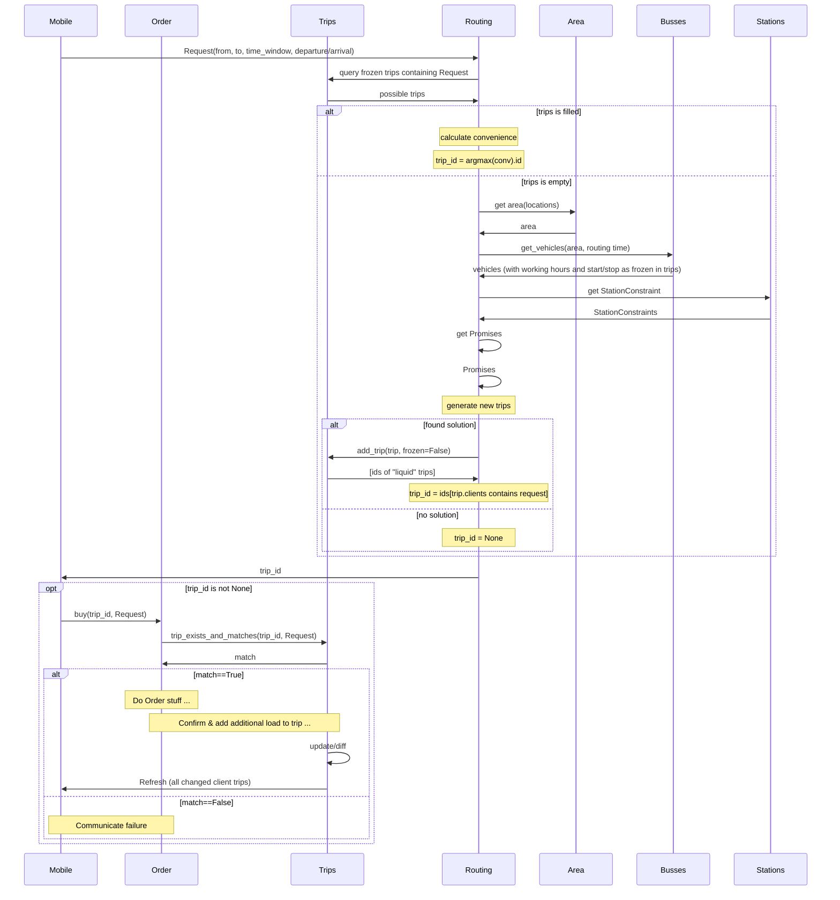

```mermaid
sequenceDiagram
    Participant Mobile
    Participant Order
    Participant Trips
    Mobile->>Routing: Request(from, to, time_window, departure/arrival)
    Routing->>Trips: query frozen trips containing Request
    Trips->>Routing: possible trips
    alt trips is filled
        Note over Routing: calculate convenience
        Note over Routing: trip_id = argmax(conv).id
    else trips is empty
        Routing->>Area: get area(locations)
        Area->>Routing: area
        Routing->>Busses: get_vehicles(area, routing time)
        Busses->>Routing: vehicles (with working hours and start/stop as frozen in trips)
        Routing->>Stations: get StationConstraint
        Stations->>Routing: StationConstraints
        Routing->>Routing: get Promises
        Routing->>Routing: Promises
        Note over Routing: generate new trips
        alt found solution
            Routing->>Trips: add_trip(trip, frozen=False)
            Trips->>Routing: [ids of "liquid" trips]
            Note over Routing: trip_id = ids[trip.clients contains request]
        else no solution
            Note over Routing: trip_id = None
        end
    end

    Routing->>Mobile: trip_id

    opt trip_id is not None
        Mobile->>Order: buy(trip_id, Request)
        Order->>Trips: trip_exists_and_matches(trip_id, Request)
        Trips->>Order: match
        alt match==True
            Note over Order: Do Order stuff ...
            Note over Order,Trips: Confirm & add additional load to trip ...
            Trips->>Trips: update/diff
            Trips->>Mobile: Refresh (all changed client trips)
        else match==False
            Note over Order,Mobile: Communicate failure
        end
    end
```
